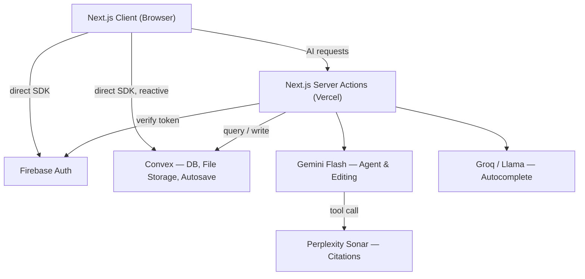

<div align="center">

# Reindex AI

by 2030 SUKSES!

**AI-native document editor for academic writing.**
Research, cite, and write — without leaving the page.


</div>

---

## The problem

General-purpose AI assistants live outside your document — you write, copy, switch windows, paste. For academic work, this gets worse: LLMs regularly **hallucinate citations**, inventing sources that sound plausible but don't exist. Meanwhile, existing editors (Google Docs, Word) treat AI as a bolt-on feature, not a native part of the writing process.

**Reindex AI** puts the agent inside the document. It reads what you're working on, edits it directly through tool-calling, and grounds every citation in a real, verifiable source.

## Why Reindex AI

| | Reindex AI | Notion AI | ChatGPT / Claude (web) |
|---|:---:|:---:|:---:|
| AI edits the document directly | ✅ | ✅ | ❌ copy-paste |
| Citations grounded in real sources | ✅ | ❌ | ❌ |
| Built specifically for academic writing | ✅ | ❌ | ❌ |
| Full context of the open document | ✅ | ✅ | ❌ |

## 🧠 Multi-Agent Orchestration

Reindex AI doesn't bet everything on one model. Under the hood runs a **heterogeneous, task-specialized multi-agent pipeline** — three purpose-built models, each deployed for the specific cognitive workload it's actually good at, unified through a single provider-agnostic orchestration layer.

| Agent | Model | Role | Why *this* model, specifically |
|---|---|---|---|
| 🎯 **Reasoning Agent** | Gemini Flash | Sidebar agent · tool-calling document edits · selection-based rewriting | Frontier-grade reasoning with rock-solid structured tool-calling, at a cost profile that doesn't punish every keystroke |
| ⚡ **Velocity Agent** | Groq (Llama) | Inline autocomplete | Runs on Groq's **LPU inference engine** — near-instant token generation, because a 2-second lag on autocomplete isn't autocomplete, it's a loading spinner |
| 🔎 **Grounding Agent** | Perplexity Sonar | Citation & literature search | Search-native, source-grounded generation — invoked as a **tool call by the Reasoning Agent**, not a bolted-on plugin, purpose-built to fight citation hallucination at the source |

**Why multi-model instead of one flagship model doing everything?** Because reasoning-heavy agentic edits, sub-second autocomplete, and citation-grounded retrieval have completely different latency, cost, and capability profiles. Routing every request through one model to rule them all means either overpaying a flagship model to autocomplete a comma, or crippling your agent to keep autocomplete cheap. Reindex AI routes each request to the model actually engineered for that job — a **best-of-breed AI stack**, not a one-size-fits-all bottleneck.

All three agents are wired through **Vercel AI SDK** as a single orchestration layer — model-agnostic by design, so any agent can be swapped, upgraded, or re-routed without touching business logic.

## Features

- **Native rich-text editor** — a familiar, Google Docs-like writing surface
- **Sidebar AI agent** — reads the open document and edits it directly via tool-calling, not a detached chat window
- **Grounded citation search** — powered by Perplexity Sonar, called by the agent as a tool when research is needed
- **Selection-based editing** — highlight any passage, describe the change, done
- **Inline autocomplete** — low-latency completions on a separate fast model

## Architecture



Document content persists to Convex on autosave. There is no realtime CRDT layer — Reindex AI is single-writer per session by design, not a multiplayer editor.

## Tech Stack

| Layer | Choice |
|---|---|
| Framework | Next.js 16 (App Router), React 19, TypeScript |
| Data | Convex — database, file storage, reactive sync |
| Auth | Firebase / Identity Platform |
| Editor | TipTap (ProseMirror) |
| AI orchestration | Vercel AI SDK |
| AI models | Gemini Flash (agent + editing), Groq/Llama (autocomplete), Perplexity Sonar (citations) |
| UI | Tailwind CSS, shadcn/ui |
| Hosting | Vercel |

Full rationale for each decision lives in [`MASTER_PROMPT.md`](./MASTER_PROMPT.md).

## Getting Started

### Prerequisites

- Node.js 22 LTS
- Accounts + API keys: Firebase, Convex, Google AI Studio (Gemini), Groq, Perplexity

### Installation

```bash
git clone <repo-url>
cd reindex-ai
npm install
```

### Environment Variables

```bash
cp .env.example .env.local
```

Fill in `.env.local` — each variable is documented inline with where to obtain it.

### Run locally

```bash
# Terminal 1 — Convex (first run will prompt login / project setup)
npx convex dev

# Terminal 2 — Next.js dev server
npm run dev
```

Open [http://localhost:3000](http://localhost:3000).

## Status

Single-writer per session. All core features (editor, sidebar agent, selection edit, autocomplete) are the target scope for this build — see `MASTER_PROMPT.md` for what's explicitly out of scope.

## License

MIT — update this if that's not the intended license.